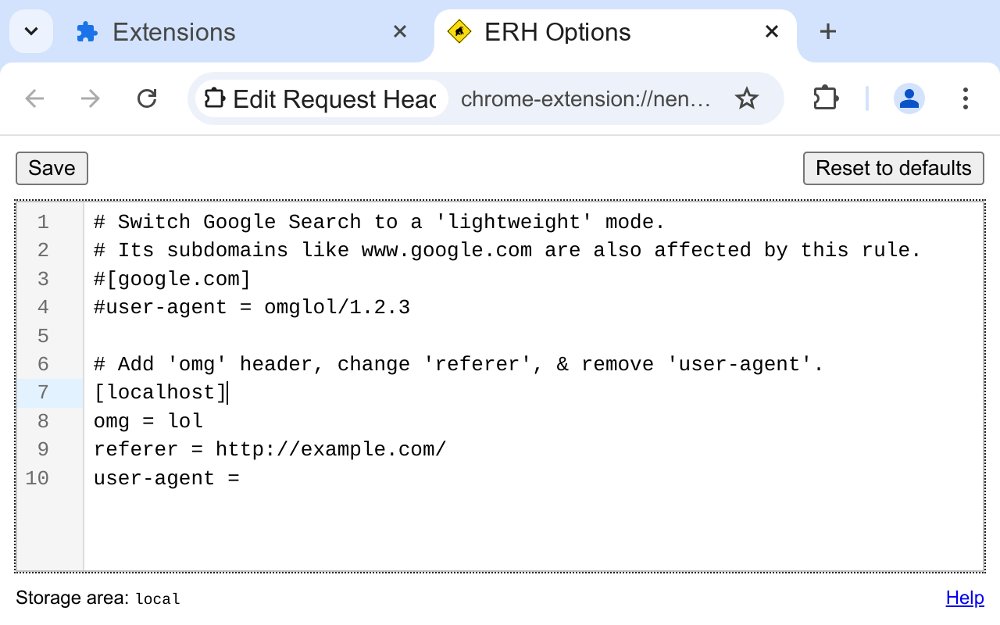

A browser extension (manifest v3) to add, modify, or remove HTTP
request headers (such as Referer or Cookie) using the
declarativeNetRequest API.

* [.crx file][]

Upon installation, you'll see an options page resembling an INI-file
editor:

Each INI section corresponds to a separate *rule*. The section name
serves as a simple *URL filter*, which can be:

* a domain name, like `example.com`;
* a domain name with a pathname, like `example.com/foo`.

Subdomains will be matched as well (e.g., `www.example.com`). To disable
this, prefix the *URL filter* with `https://`.

Each key-value pair corresponds to a header name and its desired
value. If the value is empty, the header will be removed from the
request.

The one exception is the special `.priority` key that sets an internal
property of a *rule*. The default value is 1 (the lowest
priority). For each extension, browser picks at most 1 candidate per
request, hence when > 1 extension has a matching rule, increasing the
value of the `.priority` key may help.

## Install

~~~
$ sudo dnf install jq jsonnet
$ make crx
$ find -name \*crx
~~~

Drag-and-drop a generated .crx into `chrome://extensions/`, then visit
a [test page][]

## License

MIT

[.crx file]: https://gromnitsky.users.sourceforge.net/js/chrome/
[test page]: https://gromnitsky.users.sourceforge.net/js/chrome/edit-request-headers-test/
